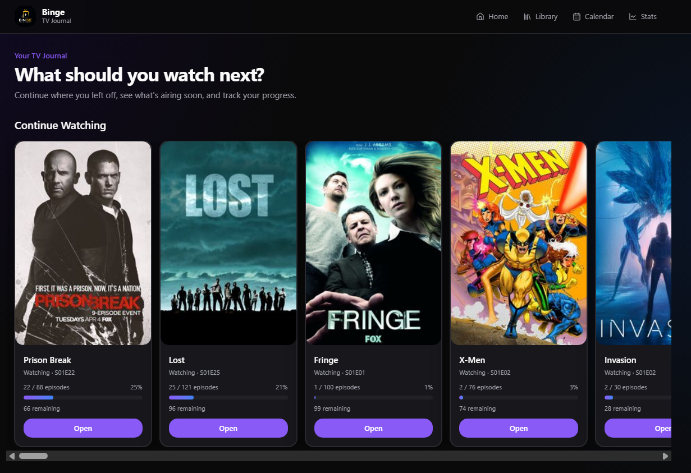

# Binge

A personal TV journal to track what you're watching, what's next, and your progress across hundreds of shows.

**Live site:** [binge.adheesha.dev](https://binge.adheesha.dev/)



## Features

- **Home feed** — continue watching, upcoming episodes, recently added and finished shows
- **Library** — browse 250+ shows with status filters (watching, completed, plan to watch, on hold)
- **Show pages** — episode lists, progress, reviews, and ratings
- **Calendar** — upcoming air dates for shows you're watching
- **Stats** — hours watched, episodes completed, top genres and networks

## Stack

| Layer | Technology |
|-------|------------|
| Frontend | Next.js, React, Tailwind CSS, TanStack Query |
| Backend | Cloudflare Workers |
| Database | Cloudflare D1 |
| Cache | Cloudflare KV |
| TV metadata | TVMaze API |

## Project structure

```text
apps/
  api/    Cloudflare Workers API
  web/    Next.js static frontend (Cloudflare Pages)
```

## Local development

**Prerequisites:** Node.js 20+, Cloudflare account (for remote API/D1)

```bash
npm install

# API — create apps/api/.env from .env.example, then:
cd apps/api
npm run setup:env      # sync password hash to .dev.vars
npm run db:migrate:local
npm run dev

# Web (separate terminal)
cd apps/web
npm run dev
```

Open [http://localhost:3000](http://localhost:3000). The web app proxies API requests to the Worker in dev.

## Deploy

```bash
# API (requires apps/api/.env with ADMIN_PASSWORD)
cd apps/api
npm run deploy:safe

# Web
cd apps/web
npm run pages:deploy
```

## Documentation

- [PROJECT_DOCUMENTATION.md](./PROJECT_DOCUMENTATION.md) — architecture and implementation overview
- [QA_REPORT.md](./QA_REPORT.md) — quality assurance review
- [SECURITY_REPORT.md](./SECURITY_REPORT.md) — security analysis

## License

Private project — all rights reserved.
